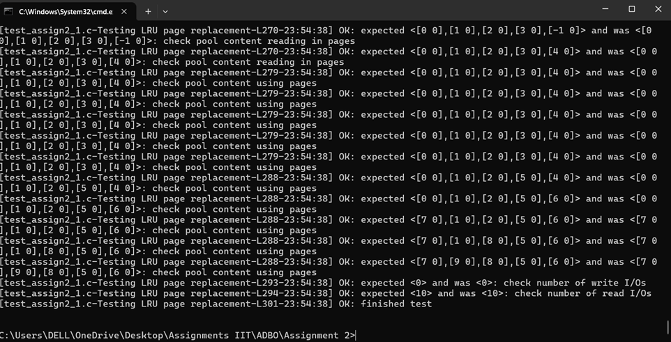
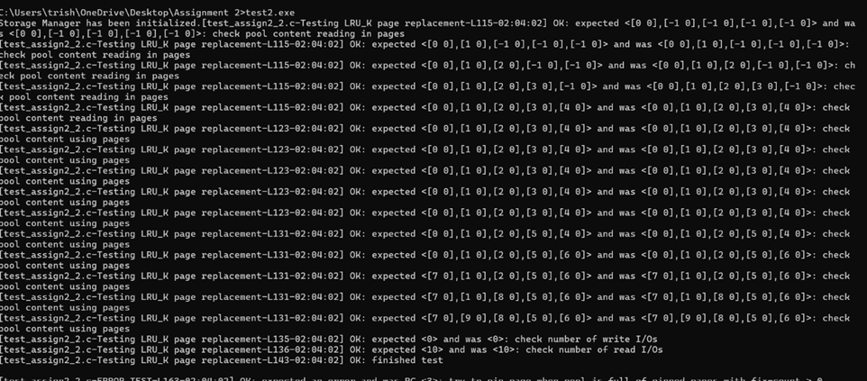

### **Assignment 2 – Buffer Manager**

The goal of this assignment is to implement a simple buffer manager. The buffer manager manages a fixed number of pages in memory that represent pages from a page file managed by the storage manager implemented in assignment 1. The memory pages managed by the buffer manager are called page frames or frames for short. We call the combination of a page file and the page frames storing pages from that file a Buffer Pool . The buffer manager should be able to handle more than one open buffer pool at the same time. However, there can only be one buffer pool for each page file. Each buffer pool uses one page replacement strategy that is determined when the buffer pool is initialized. You should at least implement two replacement strategies FIFO and LRU. Your solution should implement all the methods defined in the buffer mgr.h header explained below.
-----------------------------------------------------------------------------------------------------------------

###BUFFER POOL FUNCTIONS

# initBufferPool:

-This creates a new buffer pool in memory.

-pageFileName stores the name of the name of the page file whose pages are being cached in memory.

-numPages defines the size of the buffer i.e. number of page frames that can be stored in the buffer.

-Strategy(page replacement strategy) - (FIFO, LRU, LFU, CLOCK) that will be used by this buffer pool.

-stratData is used to pass parameters to the page replacement strategy.

# shutdownBufferPool: 

-This function shutsdown i.e. destroys the buffer pool.

-It free up all memory space being used by the Buffer Manager for the buffer pool.

-Before destroying the buffer pool,we call forceFlushPool(...) which writes all the dirty pages(pages that were modified) to the disk.

-If any page is being used by any client, then it throws RC_PINNED_PAGES_IN_BUFFER error.

# forceFlushPool

-This function writes all the dirty pages (modified pages whose dirtyBit = 1) to the disk.

-It checks all the page frames in buffer pool and checks if it's dirtyBit = 1 (which indicates that content of the page frame has been modified by some client) and fixCount = 0 (which indicates no user is using that page Frame) and if both conditions are satisfied then it writes the page frame to the page file on disk.

-----------------------------------------------------------------------------------------------
###Page Management Functions

The page management related functions are used to load pages from disk into the buffer pool (pin pages), remove a page frame from buffer pool (unpin page), mark page as dirty and force a page frame to be written to the disk.
# pinPage:
-This function reads the page from the page file present on disk and stores it in the buffer pool.
-Before pinning a page, it checks if the buffer pool has an empty space. If it has an empty space, then the page frame can be stored in the buffer pool else a page replacement strategy(FIFO, LRU, LFU and CLOCK) has to be used in order to replace a page in the buffer pool.

- The page replacement algorithms determine which page has to be replaced. That respective page is checked if it is dirty. In case it's dirtyBit = 1, then the contents of the page frame is written to the page file on disk and the new page is placed at that location where the old page was.

# unpinPage:
- This function unpins the specified page. The page to be unpinned is decided using page's pageNum.
- After locating the page using a loop, it decrements the fixCount of that page by 1 which means that the client is no longer using this page.

# makeDirty:
- This function set's the dirtyBit of the specified page frame to 1.
- It locates the page frame through pageNum by iteratively checking each page in the buffer pool and when the page id founf it set's dirtyBit = 1 for that page.

# forcePage:

- This page writes the content of the specified page frame to the page file present on disk.
- It locates the specified page using pageNum by checking all the pages in the buffer loop using a loop construct.
- When the page is found, it uses the Storage Manager functions to write the content of the page frame to the page file on disk. After writing, it sets dirtyBit = 0 for that page.
-------------------------------------------------------------------------------------------

### STATISTICS FUNCTIONS:
The statistics related functions are used to gather some information about the buffer pool. So it provides various statistical information about the buffer pool.

# getFrameContents:

- This function returns an array of PageNumbers. The array size = buffer size (numPages).
- We iterate over all the page frames in the buffer pool to get the pageNum value of the page frames present in the buffer pool.
- The "n"th element is the page number of the page stored in the "n"th page frame.

# getDirtyFlags:

- This function returns an array of bools. The array size = buffer size (numPages).
-We iterate over all the page frames in the buffer pool to get the dirtyBit value of the page frames present in the buffer pool.
- The "n"th element is the TRUE if the page stored in the "n"th page frame is dirty.

# getFixCounts:

- This function returns an array of ints. The array size = buffer size (numPages).
- We iterate over all the page frames in the buffer pool to get the fixCount value of the page frames present in the buffer pool.
- The "n"th element is the fixCount of the page stored in the "n"th page frame.

# getNumReadIO:

- This function returns the count of total number of IO reads performed by the buffer pool i.e. number of pages read from the disk.
- We maintain this data using the rearIndex variable.

# getNumWriteIO:

 - This function returns the count of total number of IO writes performed by the buffer pool i.e. number of pages written to the disk.
- We maintain this data using the writeCount variable. We initialize writeCount to 0 when buffer pool is initialized and increment it whenever a page frame is written to disk.

-----------------------------------------------------------------------------------------------------------------

### PAGE REPLACEMENT ALGORITHM FUNCTIONS

The page replacement strategy functions implement FIFO, LRU, LFU, CLOCK algorithms which are used while pinning a page. If the buffer pool is full and a new page has to be pinned, then a page should be replaced from the buffer pool. These page replacement strategies determine which page has to be replaced from the buffer pool.

# FIFO:
- First In First Out (FIFO) is the most basic page replacement strategy used.
- FIFO is generally like a queue where the page which comes first in the buffer pool is in front and that page will be replaced first if the buffer pool is full.
- Once the page is located, we write the content of the page frame to the page file on disk and then add the new page at that location.

# LFU:
- Least Frequently Used (LFU) removes the page frame which is used the least times (lowest number of times) amongst the other page frames in the buffer pool.
- The variable (field) refNum in each page frame serves this purpose. refNum keeps a count of of the page frames being accessed by the client.
- So when we are using LFU, we just need to find the position of the page frame having the lowest value of refNum.
- We then write the content of the page frame to the page file on disk and then add the new page at that location.
- Also, we store the position of the least frequently used page frame in a variable "lfuPointer" so that is useful next time when we are replacing a page in the buffer pool. It reduces the number of iterations from 2nd page replacement onwards.

# LRU:
- Least Recently Used (LRU) removes the page frame which hasn't been used for a long time (least recent) amongst the other page frames in the buffer pool.
- The variable (field) hitNum in each page frame serves this purpose. hitNum keeps a count of of the page frames being accessed and pinned by the client. Also a global variable "hit" is used for this purpose.
- So when we are using LRU, we just need to find the position of the page frame having the lowest value of hitNum.
- We then write the content of the page frame to the page file on disk and then add the new page at that location.

# CLOCK:
- CLOCK algorithm keeps a track of the last added page frame in the buffer pool. Also, we use a clockPointer which is a counter to point the page frames in the buffer pool.
- When a page has to be replaced we check the "clockPointer"s position. If that position's page's hitNum is not 1 (i.e. it wasn't the last page added), then replace that page with the new page.
- In case, hitNum = 1, then we set it's hitNum = 0, increment clockPointer i.e. we go to the next page frame to check the same thing. This process goes on until we find a position to replace the page. We set hitNum = 0 so that we don't enter into an infinite loop.

-------------------------------------------------------------------------------------------

### How to Run (FOR WINDOWS) :

Loom url: https://www.loom.com/share/74254f07524e4310b5272c39fd646a4c?sid=88e4d201-0b97-4f30-a594-4ac22a9ec7a5

OutPut ScreenShot:

Test1 result output :

Test2 result output :

